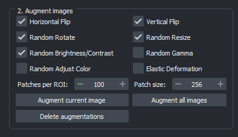
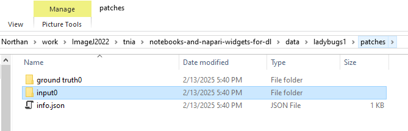
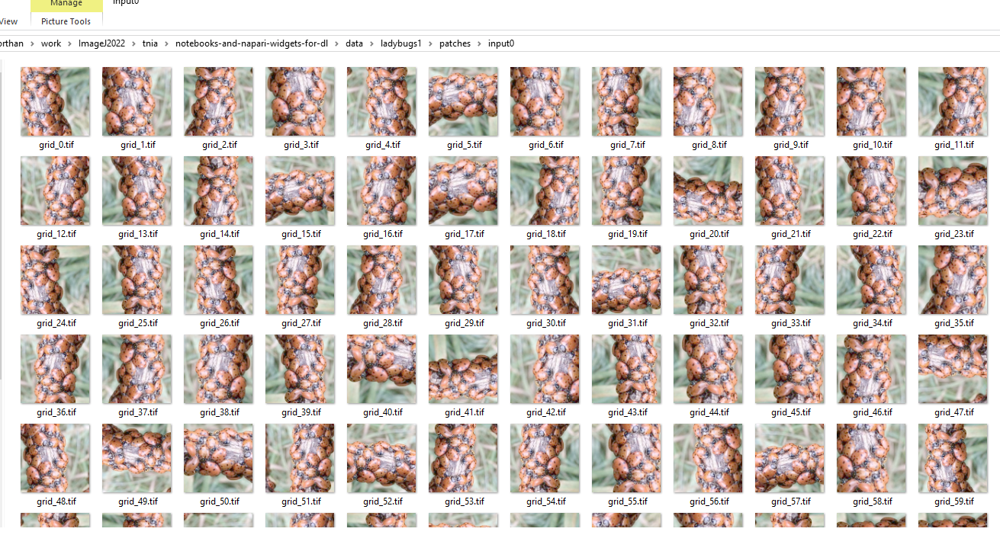

# Configure Augmentations  

You need to generate augmentations before training. 

## 🎛️ Augmentation Panel  
  

### Steps:  
1️⃣ Make sure you draw at least one label box and label objects within it. See [here](https://true-north-intelligent-algorithms.github.io/napari-easy-augment-batch-dl/load_and_label/)  
2️⃣ Select the augmentation types (rotation, flipping, brightness/contrast, etc.)  
3️⃣ Choose ```Augment current image``` or ```Augment all images```  
4️⃣ Verify by looking in the ```patches``` sub-directory of your project.

After completing above steps you should find a ```ground truth``` and ```input``` directory has been created in your project in the ```patches directory```  



Within the ```input``` directory you should see a collection of patches from your images, in the ```ground truth``` directory there should be corresponding patches taken from the label image.  Make sure you draw at least one label box and label objects within it. See (here)[]



---

🔄 **Next:** [Run & Export](run_and_export.md)  
