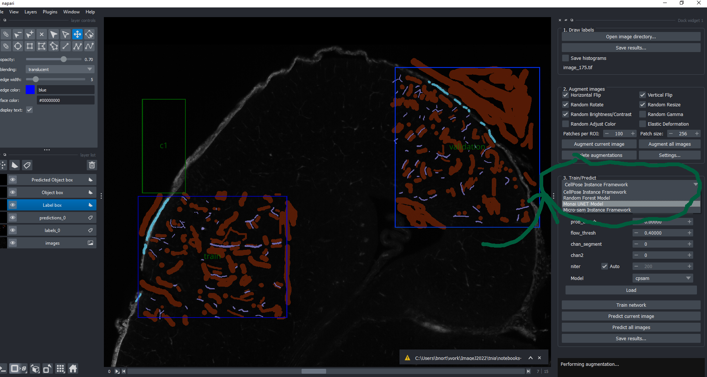
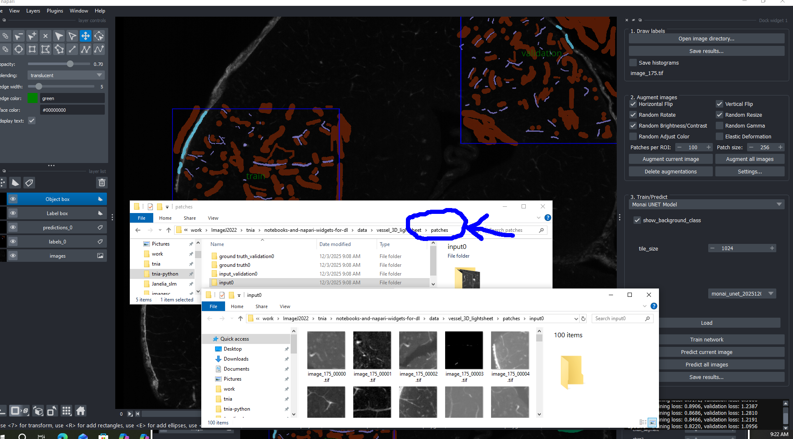

# Frequently Asked Questions (FAQ)

## ❓ When I try to train the model there is a freeze/crash?

This can happen for several reasons, and we recommend posting on [image.sc](https://forum.image.sc/) to get help troubleshooting deep learning dependencies and GPU drivers.

One common issue we've noticed is that **training with the wrong model type** can lead to problems. For example, in the screenshot below, the labels are drawn for **semantic segmentation**, but issues can occur if you accidentally select an **instance segmentation** framework instead.

**Solution:** Make sure you choose the right framework for your specific problem! 

- **Semantic Segmentation**: Use frameworks like "Monai UNET Model" or "Pytorch Semantic Model"
- **Instance Segmentation**: Use frameworks like "CellPose Instance Framework" or "Micro-sam Instance Framework"

If the freeze/crash persists after verifying your framework choice, please share details about your setup on the forum, and the community will be happy to help! 😊

## ❓ I can't find my training and validation augmentations?

Sometimes there's confusion between **labels** and **patches** (augmentations). Let's clarify the difference!

**Labels:**
- These are the annotations you manually drew and marked with a bounding box
- Saved in the `labels` directory
- Validation labels won't be so indicated in the labels folder structure

**Patches (Augmentations):**
- These are the hundreds of small, augmented images generated **from** your labels
- Created when you run the augmentation step
- Saved in the `patches` directory
- when the validation labels are used to generate patches, those patches will have 'validation' appended to them. 

**Where to find validation data:**

If you marked some labels as "validation" (by pressing the `v` key), they won't be marked as such in your labels directory structure. However, after you run augmentation, you'll find them marked 'validation' in the **patches** folder! Look for subdirectories like:
- `input_validation0` for validation images
- `ground truth_validation0` for validation labels

The patches directory is where all your training **and** validation augmentations live, ready for the model to learn from! 🎉

## ❓ Have a question ... let us know and we add it to the FAQ 

