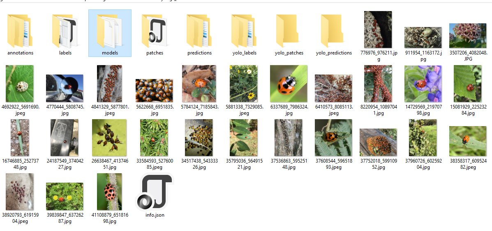

## File Organization

When you save results from ```napari-easy-augment-batch-dl``` the following file structure will be generated.   You can use notebooks to generate these files independent of ```napari-easy-augment-batch-dl```. 

It is useful to understand this file organization as it will help you find artifacts (such as labels, models, and predictions) generated by ```napari-easy-augment-batch-dl```.

**annotations**:  the annotated images  
**labels**: Labels are generated from the 'Label Box' rois.   A annotation will not be made into a label unless a bounding box has been drawn around it.  
**models**: Trained models are stored here.  
**patches**: Patches are regions extracted from labels and augmented.  You can have potentially thousands of patches.  
**predictions**: Predictions generated from models  
**yolo-labels/patches/predictions**: These are bounding boxes in Yolo format. 

