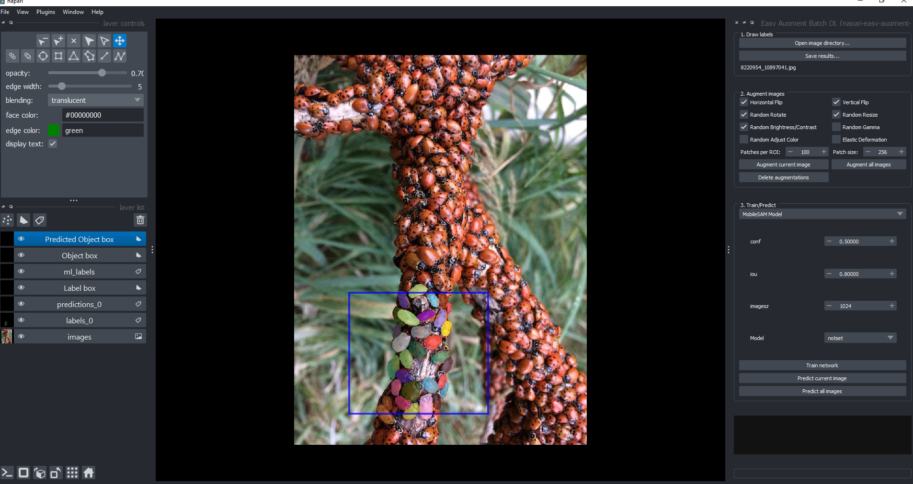

# Load

## Preparation

Prior to using this plugin, put the images you want to work with in a project directory as shown below.  


## 📌 Load Panel  

After starting the plugin the first step is to load your images.  

  

1️⃣ Click the **Open image directory...** button.  
2️⃣ Select the directory that contains your image files.  
3️⃣ Your images will load as a series and several layers will be added to Napari as shown below.


*Main screen showing various layers and annotations.*

## Layers

After loading you should see the following layers:

 1. **Images:** The image set you are working with.

 2. **Labels:** Manually drawn labels.

 3. **Predictions:** Predictions from the trained model.

 4. **Label Box:** Indicates which regions should be used for training. Manually drawn labels outside of a label box will not be used for training. In the figure above, the blue box is a label box.

 5. **ml_labels (experimental):** Labels used for live ML training. Experiment with live machine learning training using these labels.

 6. **Object Box (experimental):** Annotate individual objects with a bounding box. This type of annotation is used for training YOLO and other object detection methods.

 7. **Predicted Object Box (experimental):** Predicted object box from YOLO or other object detection frameworks.

## Save Results

Select ```Save Results``` periodically to save your work.  

  

After saving results folders should be generated for different types of deep learning artifacts.  


---

🔄 **Next:** [Predict](predict.md)
