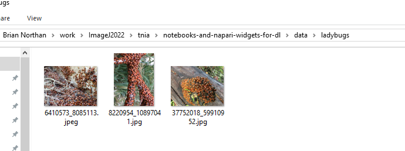
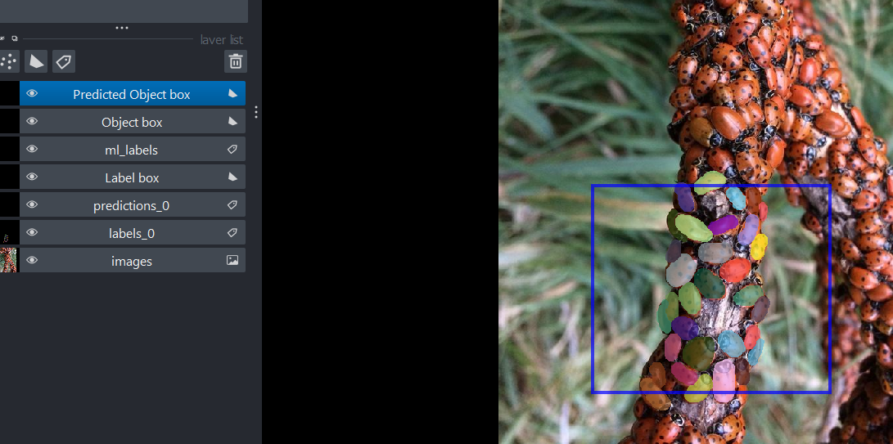
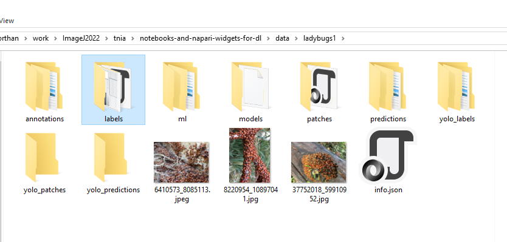
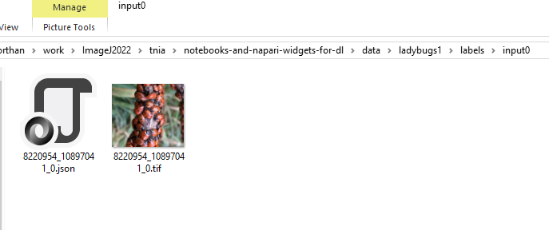

# Load and Label

## Preparation

Prior to using this plugin, put the images you want to work with in a project directory as shown below.  



## 📌 Load Panel  

After starting the plugin the first step is to load your images and assign labels.  

  

1️⃣ Click the **Open image directory...** button.  
2️⃣ Select the directory that contains your image files.  

## Drawing Labels

1️⃣ Select **Label box** layer and draw a label box that is as large or larger than the desired patch size.  
2️⃣ Select **labels** layer and Label objects within the label box.




## Save Results

Select ```Save Results``` periodically to save the labels you have drawn.  

  

After saving results folders should be generated for different types of deep learning artifacts.  



Inspect the labels directory to verify labels you have drawn have been saved.  


---

🔄 **Next:** [Configure Augmentations](configure_augmentations.md)
