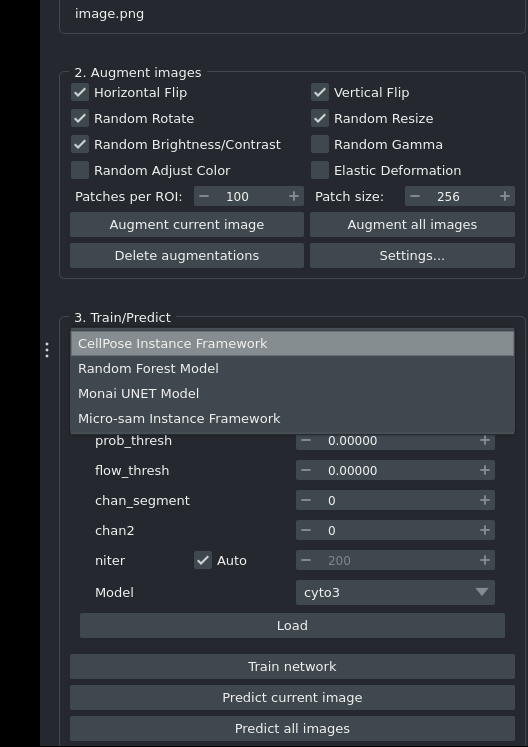
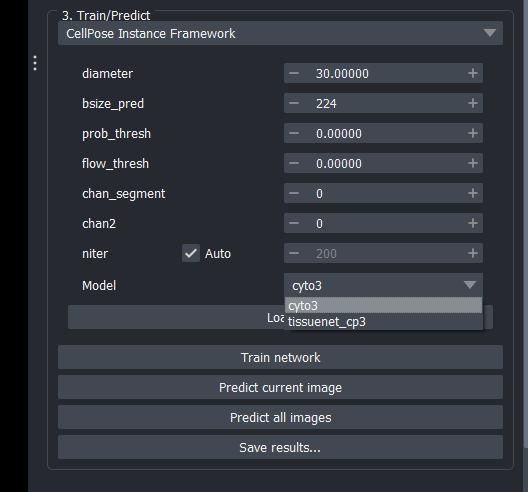

# Predict

Predict with builtin or pre-trained models

## Choose a framework  

Choose frameworks using the dropdown in group 3 (```Train/Predict```).  Available frameworks will depend on what is installed in the current environment. 

For example in the framework below we have Cellpose, Microsam, Monai UNET, and Random Forest available on the dropdown.  



## Choose builtin models

To choose a builtin model go to the ```model``` drop down in the ```Train/Predict``` group and choose one of the builtin models.  The below screenshot shows how this works for the ```Cellpose``` framework.  The user has the choice to choose between ```cyto3``` and ```tissuenet_cp3``` (there are many more ```Cellpose``` models that could be added at a future date)



## Load Pretrained Model

In the ```Train/Predict``` group choose ```Load``` then browse to the ```models``` directory.  Models that were trained with Napari-Easy-Augment-Batch-DL will be stored in the standard format for each framework, in the projects ```models``` directory. 

1.  ```Cellpose``` are stored under the ```models``` directory in a file without an extension.
2.  ```Microsam``` models are stored in ```models\checkpoints\name_of_model\best.pt```
3.  ```Pytorch``` and ```Monai UNET``` models are stored under the ```models``` directory in a ```.pt``` file.
4.  ```Stardist``` models are stored under the ```models``` directory in a folder that contains a ```config.json``` file and a ```weights_best.h5``` file (choose the folder in this case).  

Note.  Models can be loaded from any source as long as they are in the correct folder. 

## Predict

Hit ```Predict Current Image``` or ```Predict All Images``` then labels will be generated and added to the ```Predictions``` layer. 


