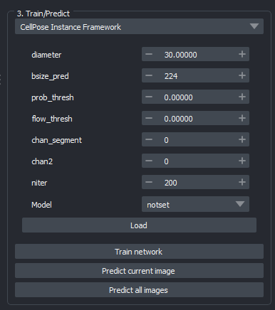
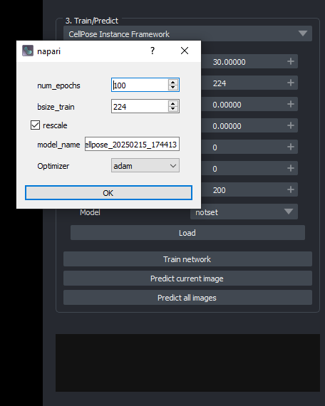
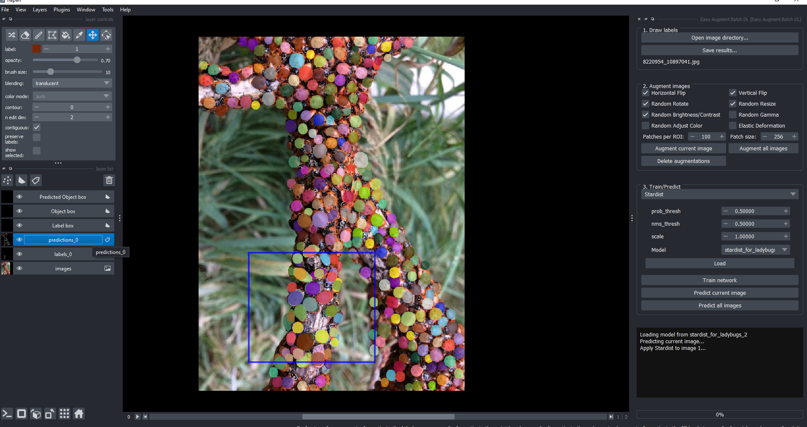

# Train and Predict  

Train a model using your labeled data and make predictions on new images.  

## 🏋️ Training & Prediction Panel  
  

### Steps:  
1️⃣ Choose a model from dropdown and configure training parameters.  
2️⃣ Train using labeled images.  
3️⃣ Use the trained model to predict labels on new images.  

## Training popup 

After hitting train a popup should appear which allows you to further adjust training parameters.  



After training (or after loading or setting a model) choose ```Predict current image``` or ```Predict all images``` to predict.   The ```prediction``` layer should be populated with the predictions as shown in the below screen shot.  


---

🔄 **Next:** [Run & Export](run_and_export.md)  
