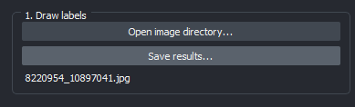
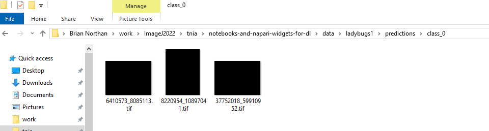

# Train and Predict  

Train a model using your labeled data and make predictions on new images.  

## 🏋️ Training & Prediction Panel  
  

### Steps:  
1️⃣ Choose a model from dropdown and configure parameters.  
2️⃣ Press 'Train network' a popup will appear that allows you to configure additional parameters.  
3️⃣ Hit 'Predict current image' or 'Predict all images' to use the trained model to predict labels.  

## Training popup 

After hitting train a popup should appear which allows you to further adjust training parameters.  


After training (or after loading or setting a model) choose ```Predict current image``` or ```Predict all images``` to predict.   The ```prediction``` layer should be populated with the predictions as shown in the below screen shot.  


After predicting you need to save the project again and the predictions will be written to disk



The predictions will be written in your project folder under ```predictions\class_0```.  



---

🔄 **Next:** [Run & Export](run_and_export.md)  
